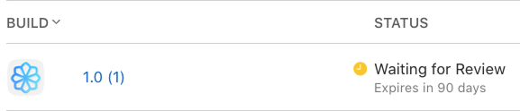

#  إرشاد · Irshad 🗣️💼

**A voice-controlled Arabic/English business guide that feels like a normal conversation and uses curated UAE license and bank database to create your tailored business action plan.**

Tatweer Hackathon 2026 · Al Qua'a, Al Ain, UAE · Challenge 1 — Taking the First Entrepreneurial Step

 

`Swift iOS` · `OpenRouter LLM` · `UAE Licenses & Bank Database` · `English + Arabic`

Demo: spoken idea → adaptive questions → grounded roadmap. Replace the URL above with the final YouTube demo link.

---

## 🔹 Irshad in 60 Seconds

| | |
|---|---|
| **Problem** | First-time rural founders often know their business idea, but not the legal, authority, banking, document, and cost steps needed to start. |
| **Solution** | Irshad lets the founder speak naturally, asks only the questions needed, and produces a first-step action plan with confidence labels. |
| **Built** | Working SwiftUI app, voice input/output, adaptive cards, final plan screen, and a sourced Abu Dhabi knowledge base. |
| **Why it matters** | It turns a confusing setup process into one guided conversation, while clearly showing what is verified, estimated, missing, or still needs official confirmation. |
| **How to verify** | Run the app, use the API smoke test, inspect `Backend/kb/knowledge.json`, and check the evidence pack linked below. |

---

## 🎯 I. The Challenge and the Problem

**Chosen challenge:** Challenge 1 — Taking the First Entrepreneurial Step.

Irshad targets the moment before a business exists: when a founder has a real idea, but does not know the first legal, banking, authority, and document steps.

This is a real procedural problem. The UAE official business setup flow includes identifying the business activity, selecting the legal form, applying for a trade licence, registering the trade name, applying for initial approval, choosing a location, getting additional government approvals, submitting documents, and paying fees. Abu Dhabi’s ADRA setup guidance also starts with business activity and may require additional approvals depending on the activity and location.

For a first-time founder, the blocker is not the business idea. It is knowing which licence applies, which authority to contact, what documents are needed, what it may cost, and what must be officially verified.

### The example we built around

> Ahmed is 55. He has kept camels in Al Qua'a his whole life. Neighbours already buy his camel milk. He has AED 20,000 and wants to sell legally. He does not know which licence, authority, bank, documents, or cost path applies, so the idea stays stuck.

Ahmed is fictional, but the friction is real: official steps exist, but they are spread across portals and written for people who already understand the system.

---

## 👥 II. Who It Is For and the Situation They Face

| | |
|---|---|
| **Primary user** | A first-time rural founder in Al Qua'a / Al Ain with a practical business idea but no business setup experience. |
| **Business types** | Camel dairy, dates and honey, farm products, home food, tailoring / henna / craft, livestock services, small retail, repair services, tutoring, and desert / astro-tourism. |
| **Main barrier** | They know the idea, but not the licence, authority, document, cost, or banking path. |

Irshad does **not** try to replace official portals. It prepares the founder to approach them with the right question, the likely path, and the missing information already identified.

---

## 💡 III. The Solution

Irshad is a voice-first iOS guide. The founder speaks an idea. The app asks a small number of adaptive questions. The server fills a structured business profile. Once enough information is known, Irshad produces a plan with:

| Output | Example |
|---|---|
| Business activity match | Camel milk / dairy product |
| Recommended licence path | Farm / small producer or standard economic path, depending on eligibility |
| Official authority | ADRA / ADDED, ADAFSA, DCT Abu Dhabi, or another relevant body |
| Cost range | Labelled as estimated unless confirmed |
| Required approvals | Food safety, agriculture, tourism, or other activity-specific checks |
| Bank suggestions | Candidate banks matched to founder profile and documents |
| Next action | A concrete question to ask, number to call, or document to prepare |
| Confidence labels | Verified, estimated, unverified, or missing |

---

## ✅ IV. What Is Working Now

| Status | Feature |
|---|---|
| ✅ | SwiftUI iOS welcome screen with guide and language selection. |
| ✅ | Voice-first interaction using Apple Speech and `AVSpeechSynthesizer`. |
| ✅ | Server-driven question cards and progress stages. |
| ✅ | Adaptive business profile capture. |
| ✅ | Final plan screen with approvals, banks, confidence, unverified items, share, copy, and continue options. |
| ✅ | Trust labels for verified / estimated / unverified / missing facts. |
| ✅ | Sourced Abu Dhabi knowledge base. |
| ⚠️ | The prototype does not submit government applications or guarantee approval. |
| ⚠️ | Live fact verification depends on the current knowledge base and available online sources. |

---

## 📊 V. Impact, Evidence & Validation

| # | Claim | Evidence / how to test |
|---:|---|---|
| 1 | Irshad gives different questions for different businesses while keeping the same path. | Run `stargazing on my land` and `sell camel milk`; compare Stage 2 cards. The path stays fixed, but question content changes. |
| 2 | The founder can reach a first action plan without filling a traditional form. | Watch the demo video and inspect the screenshots in `Assets/` and `Evidence/screenshots/`. |
| 3 | The project is deployable with light infrastructure. | A simple Apple tesflight deployment. No GPU or heavy database required for the prototype. |

### 📚 Knowledge Base Snapshot

| Artifact | Current coverage |
|---|---|
| `Backend/kb/knowledge.json` | 7 authorities, 6 licence types, 6 banks, 5 loan products, 10 funds/programmes, 11 business archetypes |

### 🔗 Research References used for Grounding

| Area | Source | Why it matters |
|---|---|---|
| UAE business setup steps | [UAE official portal — Steps to start a business on the mainland](https://u.ae/en/information-and-services/business/doing-business-on-the-mainland/steps-to-start-a-business-on-the-mainland) | Confirms the setup process is multi-step. |
| Abu Dhabi setup path | [ADRA — Business setup](https://www.adra.gov.ae/en/establishing) | Confirms activity, location, legal form, initial approval, and additional approvals are part of setup. |
| Farm / small producer path | [ADRA — Farm Licence](https://www.adra.gov.ae/en/establishing/small-producers-licence) | Confirms the farms and small producers path for citizens who own or lease farms. |
| Abu Dhabi licensing categories | [ADDED — Licensing requirements](https://www.added.gov.ae/en/set-up/establish-your-business/licensing-requirements) | Confirms the small producers licence and standard economic licence context. |
| Agriculture and food safety | [ADAFSA — Agricultural sustainability](https://adafsa.gov.ae/en/work/agricultural-sustainability/Pages/default.aspx) | Supports agriculture / food-safety relevance in Abu Dhabi. |
| Camel farms and Al Ain relevance | [DCT Abu Dhabi — local camel farms](https://dct.gov.ae/en/media.centre/news/visit.local.camel.farms.with.the.travel.through.our.traditions.tour.series.in.al.ain.aspx) | Supports the cultural / economic relevance of camel activity around Al Ain. |
| Al Qua'a astro-tourism relevance | [Associated Press — Al Quaa Desert stargazing](https://apnews.com/article/ee678e1b535df81edc96f5140ad5e998) | Supports the local dark-sky / astro-tourism opportunity. |
| Mobile-first feasibility | [DataReportal — Digital 2026 UAE](https://datareportal.com/reports/digital-2026-united-arab-emirates) | Supports mobile-first delivery in the UAE context. |

---

## 🛡️ VI. Grounding and Safety

Irshad does not replace ADDED, ADRA, ADAFSA, TAMM, banks, lawyers, or business setup officers. It does not issue licences, submit applications, guarantee approval, or guarantee final fees.

Its safety rule is simple: show what is verified, estimate only when grounded, and mark uncertain items as unverified with the exact authority question to ask.

| Label | Meaning | Product behavior |
|---|---|---|
| **Verified** | Confirmed against a source. | Show as usable information. |
| **Estimated** | Grounded range, not an exact official figure. | Show range and avoid pretending it is final. |
| **Unverified** | Needs official confirmation. | Show the authority and the exact question to ask. |
| **Missing** | Not enough information yet. | Ask a follow-up or block final analysis. |

---

## 🚀 VII. Feasibility & Scalability

| Area | Why it is feasible now | How it scales |
|---|---|---|
| App | Runs on a normal iPhone | Same app can serve more users |
| Intelligence | OpenRouter model call | Model can be swapped |
| Knowledge | Bundled JSON KB | Swap KB per emirate/community |
| Journey | Server/card-driven flow | Add archetypes without redesigning UI |

### 📱 Deployment Path

| Phase      | Deployment                                                                                  |
| ---------- | ------------------------------------------------------------------------------------------- |
| Hackathon  | iPhone demo using the SwiftUI app with direct API calls and bundled knowledge base.         |
| TestFlight | Shared through Apple TestFlight so testers can install it using the QR code in Section XII. |

---

## 🏗️ VIII. Architecture and Tools

| Layer | Tools |
|---|---|
| **Client** | Swift 5.9, SwiftUI, iOS 16+, Apple Speech, `AVSpeechSynthesizer`, RTL-aware UI. |
| **LLM** | OpenRouter, default model currently `google/gemini-2.5-flash-lite`. |
| **Knowledge** | `Backend/kb/knowledge.json`, source URLs, authorities, licences, banks, programmes, archetypes. |
| **Verification UX** | Trust labels, unverified warnings, copyable authority questions, phone / email / official-page actions. |

---

## 🧪 IX. How to Run or Verify It

### How Judges Can Verify Irshad

Irshad is an iOS Swift prototype. Judges can verify the prototype in three ways:

1. Watch the demo video at the top of this README.
2. Review the screenshots showing the full flow from voice input to generated business setup plan.
3. Try the TestFlight link or run the project locally in Xcode using the steps below.

#### TestFlight Status

Status: Submitted for TestFlight External Testing review.

Public TestFlight link: [Open Irshad on TestFlight](https://testflight.apple.com/join/2AhV5cmH)

Note: The TestFlight link has been generated by Apple, but external access may depend on Apple completing beta review. If it is not active yet, judges can still verify the prototype through the demo video, screenshots, and local Xcode run steps.

#### Local Run Steps

1. Clone this repository.
2. Open the `.xcodeproj` or `.xcworkspace` file in Xcode.
3. Select an iPhone simulator or connected iPhone.
4. Press Run.
5. Allow microphone and speech permissions.
6. Start the Irshad flow and test the voice-guided business setup journey.

---

## 🛠️ X. Limitations and Next Steps

| Limitation | Why we accept it now | Next step |
|---|---|---|
| It does not submit applications | Submission requires official systems and user identity. | Integrate with TAMM / authority workflows only through official channels. |
| It does not guarantee fees | Fees can depend on activity, legal form, location, and date. | Keep ranges, show source dates, and add official API/data source if available. |
| It needs internet | LLM and server run remotely. | Add cached KB and offline draft mode. |
| Community validation is still limited | Hackathon timeline is short. | Run 5–10 target-user tests and update `Evidence/test-runs.md`. |
| Knowledge base can become stale | Regulations and fees change. | Add `last_verified`, owner, and review cadence to each KB record. |

---

## ❓ XI. Answering the Hard Questions

| Judge question | Our answer |
|---|---|
| Why not just use TAMM or ADDED? | Those are official destinations. Irshad prepares the founder before they go there. |
| Is this legal/business advice? | No. It is first-step guidance with uncertainty labels. |
| What if the AI is wrong? | Unsupported outputs are marked unverified or missing, not presented as final. |
| Why would rural founders use this? | It is voice-first, mobile-first, Arabic/English, and avoids long forms. |
| Can it scale beyond Al Qua'a? | Yes. The app logic stays the same; the KB and archetypes change. |

---

## 🤝 Built for

**Tatweer Hackathon 2026** · Al Qua'a, Al Ain, UAE · Challenge 1 — Taking the First Entrepreneurial Step

Repository: `AbdullahSWE/Irshad_TatweerHackathon`

*Irshad — إرشاد. Guidance, for the first step.*
