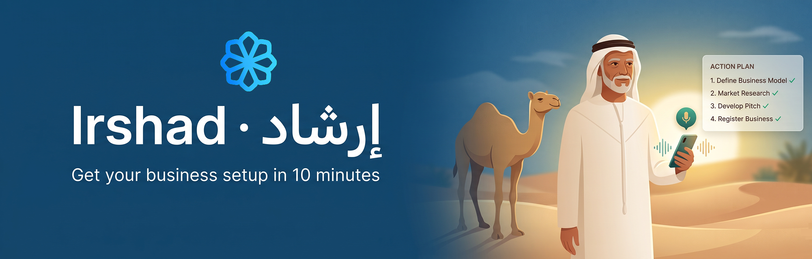
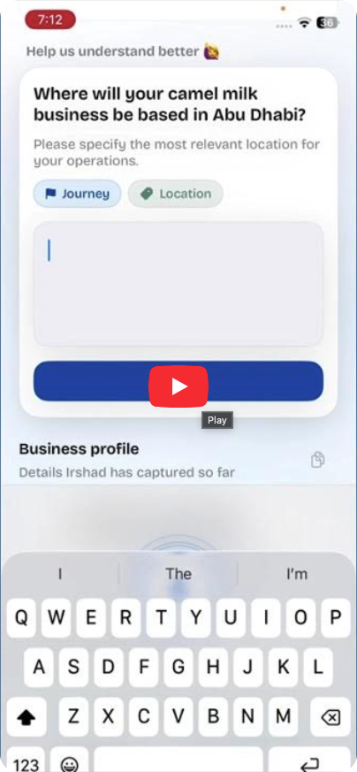
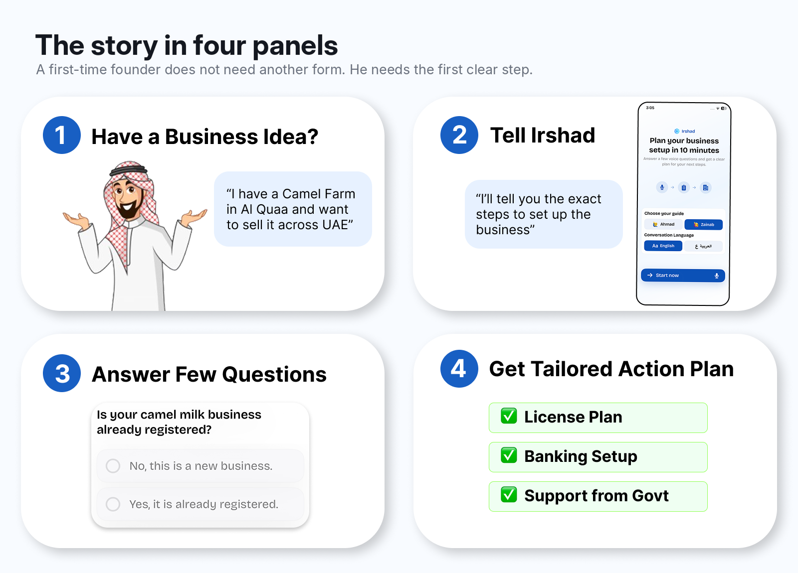
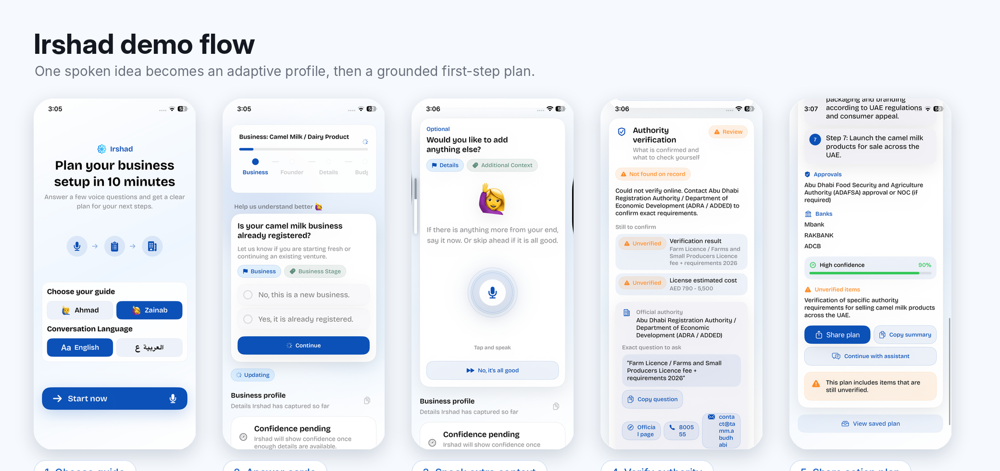
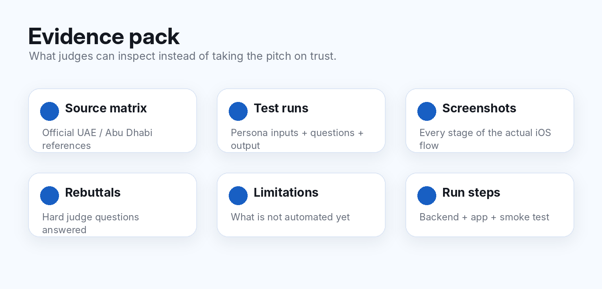
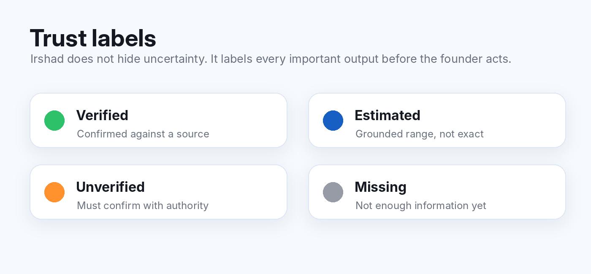
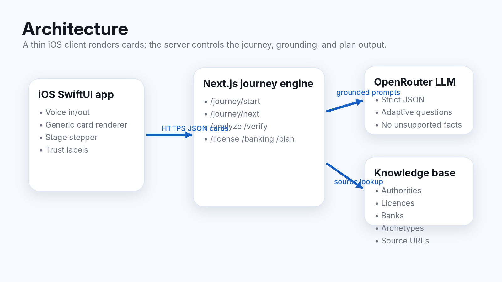

<div align="center">



# إرشاد · Irshad

**A voice-controlled Arabic/English business guide that feels like a normal conversation and uses curated UAE license and bank database to create your tailored business action plan.**

<sub>Tatweer Hackathon 2026 · Al Qua'a, Al Ain, UAE · Challenge 1 — Taking the First Entrepreneurial Step</sub>

<br/>

`SwiftUI iOS` · `OpenRouter LLM` · `UAE Licenses & Bank Database` · `English + Arabic`

</div>

<div align="center">

[](https://youtube.com/REPLACE_WITH_DEMO_LINK)

<sub>Demo: spoken idea → adaptive questions → grounded roadmap. Replace the URL above with the final YouTube demo link.</sub>

</div>

---

## Judge this in 60 seconds

| | |
|---|---|
| **Problem** | First-time rural founders often know their business idea, but not the legal, authority, banking, document, and cost steps needed to start. |
| **Solution** | Irshad lets the founder speak naturally, asks only the questions needed, and produces a first-step action plan with confidence labels. |
| **Built** | Working SwiftUI app, server-driven Next.js journey engine, voice input/output, adaptive cards, final plan screen, and a sourced Abu Dhabi knowledge base. |
| **Why it matters** | It turns a confusing setup process into one guided conversation, while clearly showing what is verified, estimated, missing, or still needs official confirmation. |
| **How to verify** | Run the app, use the API smoke test, inspect `Backend/kb/knowledge.json`, and check the evidence pack linked below. |

<div align="center">

</div>

---

## 1. The challenge and the problem

**Chosen challenge:** Challenge 1 — Taking the First Entrepreneurial Step.

Irshad targets the moment before a business exists: when a founder has a real idea, but does not know the first legal, banking, authority, and document steps.

This is a real procedural problem. The UAE official business setup flow includes identifying the business activity, selecting the legal form, applying for a trade licence, registering the trade name, applying for initial approval, choosing a location, getting additional government approvals, submitting documents, and paying fees. Abu Dhabi’s ADRA setup guidance also starts with business activity and may require additional approvals depending on the activity and location.

**Why that is hard for our user:** a first-time founder is not only asking “Can I start?” They are asking:

| Question | Why it blocks action |
|---|---|
| Which licence applies to my exact activity? | The wrong licence path wastes time and money. |
| Which authority do I contact? | ADRA / ADDED, ADAFSA, DCT Abu Dhabi, banks, and funds each cover different parts. |
| What documents do I need? | Missing documents delay the first visit or application. |
| What will it cost? | A founder with limited capital needs a realistic range before spending. |
| What must I confirm officially? | AI guidance must not pretend to replace authorities. |

### The example we built around

> Ahmed is 55. He has kept camels in Al Qua'a his whole life. Neighbours already buy his camel milk. He has AED 20,000 and wants to sell legally. He does not know which licence, authority, bank, documents, or cost path applies, so the idea stays stuck.

Ahmed is fictional, but the friction is real: official steps exist, but they are spread across portals and written for people who already understand the system.

---

## 2. Who it is for, and their situation

| | |
|---|---|
| **Primary user** | A first-time rural founder in Al Qua'a / Al Ain with a practical business idea but no business setup experience. |
| **Device reality** | Phone-first. The UAE has very high mobile and internet adoption, so a mobile-first assistant is realistic. |
| **Language reality** | The user may be more comfortable speaking Arabic than reading long English forms or portals. |
| **Business types** | Camel dairy, dates and honey, farm products, home food, tailoring / henna / craft, livestock services, small retail, repair services, tutoring, and desert / astro-tourism. |
| **Current cost of confusion** | Delays, wrong first calls, incomplete documents, uncertainty around licence fit, and sometimes paying a third party before the founder even understands the process. |

Irshad does **not** try to replace official portals. It prepares the founder to approach them with the right question, the likely path, and the missing information already identified.

---

## 3. The solution

Irshad is a voice-first iOS guide. The founder speaks an idea. The app asks a small number of adaptive questions. The server fills a structured business profile. Once enough information is known, Irshad produces a plan with:

| Output | Example |
|---|---|
| Business activity match | Camel milk / dairy product |
| Recommended licence path | Farm / small producer or standard economic path, depending on eligibility |
| Official authority | ADRA / ADDED, ADAFSA, DCT Abu Dhabi, or another relevant body |
| Cost range | Labelled as estimated unless confirmed |
| Required approvals | Food safety, agriculture, tourism, or other activity-specific checks |
| Bank suggestions | Candidate banks matched to founder profile and documents |
| Next action | A concrete question to ask, number to call, or document to prepare |
| Confidence labels | Verified, estimated, unverified, or missing |

<div align="center">

</div>

### What makes it more than a chatbot

Irshad uses a **fixed journey backbone** with AI adaptation inside each stage.

| Stage | Purpose |
|---|---|
| 1. Goal | Founder says the idea aloud. |
| 2. Business | Activity-specific questions. |
| 3. Founder | Residency, ownership, team, existing registration. |
| 4. Details | Location, sales channel, office / farm / online needs. |
| 5. Budget | Capital, employees, revenue assumptions. |
| 6. Documents | IDs, farm deed / lease, current permits, missing documents. |
| 7. Analyze | Match activity and estimate first path. |
| 8. Verify | Confirm what can be confirmed, flag what cannot. |
| 9. Licence | Recommend licence path and alternatives. |
| 10. Banking | Suggest banks and account-readiness. |
| 11. Plan | Produce the final roadmap and next action. |

Two guardrails keep the demo stable and honest:

| Guardrail | Why it matters |
|---|---|
| **Question cap** | The journey cannot loop endlessly. |
| **Completeness floor** | It does not produce a plan before core slots like activity, residency, location, and capital are known. |

---

## 4. What is working now

| Status | Feature |
|---|---|
| ✅ | SwiftUI iOS welcome screen with guide and language selection. |
| ✅ | Voice-first interaction using Apple Speech and `AVSpeechSynthesizer`. |
| ✅ | Server-driven question cards and progress stages. |
| ✅ | Adaptive business profile capture. |
| ✅ | Final plan screen with approvals, banks, confidence, unverified items, share, copy, and continue options. |
| ✅ | Trust labels for verified / estimated / unverified / missing facts. |
| ✅ | Next.js backend journey engine. |
| ✅ | Sourced Abu Dhabi knowledge base. |
| ✅ | API smoke-test path for judges who do not run the iOS app. |
| ⚠️ | The prototype does not submit government applications or guarantee approval. |
| ⚠️ | Live fact verification depends on the current knowledge base and available online sources. |

---

## 5. Impact and testable claims

| # | Claim | Evidence / how to test |
|---:|---|---|
| 1 | Irshad gives different questions for different businesses while keeping the same path. | Run `stargazing on my land` and `sell camel milk`; compare Stage 2 cards. The path stays fixed, but question content changes. |
| 2 | The founder can reach a first action plan without filling a traditional form. | Watch the demo video and inspect the screenshots in `Assets/` and `Evidence/screenshots/`. |
| 3 | Important facts are labelled instead of silently presented as certain. | See `Assets/trust-labels.png` and the final plan screenshot, where unverified items are explicitly shown. |
| 4 | The knowledge base is inspectable. | Open `Backend/kb/knowledge.json` and check source URLs, authorities, licence types, banks, and archetypes. |
| 5 | The app can be verified without the iOS build. | Run the backend smoke test in [How to run or verify](#12-how-to-run-or-verify-it). |
| 6 | The project is deployable with light infrastructure. | Thin SwiftUI client + stateless Next.js API + JSON knowledge base. No GPU or heavy database required for the prototype. |

<div align="center">

</div>

---

## 6. Evidence and validation

The judging guide rewards specific, testable claims backed by evidence, not vague hype. This repo therefore separates product claims from proof.

| Evidence | What it proves | Location |
|---|---|---|
| Demo video | End-to-end readiness | Top of README, replace with final YouTube link |
| App screenshots | The product is built and has multiple working states | `Assets/` and `Evidence/screenshots/` |
| Source matrix | The problem and KB are tied to official / reputable references | `Evidence/source-matrix.md` |
| Test run sheet | Persona-by-persona verification format | `Evidence/test-runs.md` |
| Rebuttals | Hard judge questions answered in advance | `Evidence/rebuttals.md` |
| Limitations | Honest scope and risks | `Evidence/limitations.md` |
| Run steps | Judge can verify without contacting us | This README |

### Research references used for grounding

| Area | Source | Why it matters |
|---|---|---|
| UAE business setup steps | [UAE official portal — Steps to start a business on the mainland](https://u.ae/en/information-and-services/business/doing-business-on-the-mainland/steps-to-start-a-business-on-the-mainland) | Confirms the setup process is multi-step. |
| Abu Dhabi setup path | [ADRA — Business setup](https://www.adra.gov.ae/en/establishing) | Confirms activity, location, legal form, initial approval, and additional approvals are part of setup. |
| Farm / small producer path | [ADRA — Farm Licence](https://www.adra.gov.ae/en/establishing/small-producers-licence) | Confirms the farms and small producers path for citizens who own or lease farms. |
| Abu Dhabi licensing categories | [ADDED — Licensing requirements](https://www.added.gov.ae/en/set-up/establish-your-business/licensing-requirements) | Confirms the small producers licence and standard economic licence context. |
| Agriculture and food safety | [ADAFSA — Agricultural sustainability](https://adafsa.gov.ae/en/work/agricultural-sustainability/Pages/default.aspx) | Supports agriculture / food-safety relevance in Abu Dhabi. |
| Camel farms and Al Ain relevance | [DCT Abu Dhabi — local camel farms](https://dct.gov.ae/en/media.centre/news/visit.local.camel.farms.with.the.travel.through.our.traditions.tour.series.in.al.ain.aspx) | Supports the cultural / economic relevance of camel activity around Al Ain. |
| Al Qua'a astro-tourism relevance | [Associated Press — Al Quaa Desert stargazing](https://apnews.com/article/ee678e1b535df81edc96f5140ad5e998) | Supports the local dark-sky / astro-tourism opportunity. |
| Mobile-first feasibility | [DataReportal — Digital 2026 UAE](https://datareportal.com/reports/digital-2026-united-arab-emirates) | Supports mobile-first delivery in the UAE context. |

---

## 7. Grounding and safety

An AI that invents a licence fee can hurt a founder. Irshad is designed to show uncertainty instead of hiding it.

<div align="center">

</div>

| Label | Meaning | Product behavior |
|---|---|---|
| **Verified** | Confirmed against a source. | Show as usable information. |
| **Estimated** | Grounded range, not an exact official figure. | Show range and avoid pretending it is final. |
| **Unverified** | Needs official confirmation. | Show the authority and the exact question to ask. |
| **Missing** | Not enough information yet. | Ask a follow-up or block final analysis. |

### What Irshad is not

Irshad does **not** replace ADDED, ADRA, ADAFSA, TAMM, banks, lawyers, or business setup officers.

It does **not** issue licences, submit applications, call authorities, guarantee bank approval, or guarantee that a cost estimate is final.

It helps the founder understand the likely first path, prepare the right documents and questions, and know what to verify before spending money.

---

## 8. Feasibility and deployment

| Area | Current approach | Why it is feasible |
|---|---|---|
| Client | SwiftUI iOS app | Runs on a normal iPhone; no special hardware. |
| Backend | Next.js API | Deployable to Vercel, Render, a VM, or a local server. |
| Intelligence | OpenRouter model call | Model is swappable; no GPU owned by the team. |
| Knowledge | JSON knowledge base | Easy to inspect, update, and version-control. |
| Maintenance | Update source URLs, fees, authorities, and contact details | Can be maintained by a local operator or incubator partner, not only engineers. |
| Cost profile | Low fixed infrastructure; variable LLM usage | Practical for a pilot before deeper integration. |

### Deployment path

| Phase | Deployment |
|---|---|
| Hackathon | Local backend + iPhone demo + API smoke test. |
| Pilot | Hosted backend + TestFlight app + curated KB updates. |
| Community rollout | Add local partner for source updates and user onboarding. |
| Authority partnership | Replace manual verification gaps with official API or data-sharing where available. |

---

## 9. Scalability

Irshad is designed to scale by changing the knowledge base, not rebuilding the app.

| Today | Tomorrow |
|---|---|
| Al Qua'a / Al Ain focus | Other rural UAE communities. |
| Abu Dhabi authorities | Swap to emirate-specific authorities. |
| 11 archetypes | Add more archetypes as checklist entries. |
| JSON source matrix | Replace or expand sources per region. |
| Server-driven cards | Improve the journey without App Store resubmission. |

The reusable parts are the voice interface, stage engine, trust-label system, adaptive card renderer, and final plan format.

---

## 10. Architecture and tools

<div align="center">

</div>

| Layer | Tools |
|---|---|
| **Client** | Swift 5.9, SwiftUI, iOS 16+, Apple Speech, `AVSpeechSynthesizer`, RTL-aware UI. |
| **Server** | Next.js App Router, TypeScript, route handlers. |
| **LLM** | OpenRouter, default model currently `google/gemini-2.5-flash-lite`. |
| **Knowledge** | `Backend/kb/knowledge.json`, source URLs, authorities, licences, banks, programmes, archetypes. |
| **Verification UX** | Trust labels, unverified warnings, copyable authority questions, phone / email / official-page actions. |

---

## 11. Knowledge base

The knowledge base is the repo’s most inspectable artifact.

| Record type | Current count | Each should include |
|---|---:|---|
| Government authorities | 7 | Name, role, phone, email, website, source URL. |
| Licence types | 6 | Issuer, eligibility, cost basis, source URL. |
| Banks | 6 | Requirements, documents, account-readiness notes. |
| Loan products | 5 | Eligibility, terms, support source. |
| Government funds / programmes | 10 | Who they support and how they are relevant. |
| Business archetypes | 11 | Required slots and activity-specific questions. |

Core authority naming used in the README and UI should be:

> **ADRA / ADDED — Abu Dhabi Registration Authority / Abu Dhabi Department of Economic Development**

For farm-related paths, the UI should point the founder toward the **Farm Licence / Farms and Small Producers Licence** only when eligibility fits, and otherwise mark it as something to verify with ADRA / ADDED.

---

## 12. How to run or verify it

### Backend

```bash
cd Backend
cp .env.local.example .env.local      # add OPENROUTER_API_KEY
npm install
npm run dev                           # http://localhost:3000
```

### API smoke test

```bash
curl -X POST http://localhost:3000/api/journey/start \
  -H "Content-Type: application/json" \
  -d '{"sessionId":"demo","goalText":"I want to sell camel milk legally from my farm"}'
```

Try a second idea and compare the next question:

```bash
curl -X POST http://localhost:3000/api/journey/start \
  -H "Content-Type: application/json" \
  -d '{"sessionId":"demo2","goalText":"I want to host tourists for stargazing on my land"}'
```

### iOS app

```text
1. Open App/Irshad/ in Xcode 15+
2. Set AppConfig.baseURL to the backend URL
3. Run on an iOS 16+ simulator or iPhone
4. Choose guide + language
5. Speak an idea
6. Follow the guided cards to the final plan
```

### Judge verification checklist

| Check | Where |
|---|---|
| App has real screens | `Assets/demo-flow-5up.png`, `Evidence/screenshots/` |
| Backend can start a journey | API smoke test above |
| Claims are testable | [Impact and testable claims](#5-impact-and-testable-claims) |
| Sources are inspectable | `Backend/kb/knowledge.json`, `Evidence/source-matrix.md` |
| Limitations are explicit | `Evidence/limitations.md` |
| Hard questions are answered | `Evidence/rebuttals.md` |

---

## 13. Limitations and next steps

| Limitation | Why we accept it now | Next step |
|---|---|---|
| It does not submit applications | Submission requires official systems and user identity. | Integrate with TAMM / authority workflows only through official channels. |
| It does not guarantee fees | Fees can depend on activity, legal form, location, and date. | Keep ranges, show source dates, and add official API/data source if available. |
| It needs internet | LLM and server run remotely. | Add cached KB and offline draft mode. |
| Community validation is still limited | Hackathon timeline is short. | Run 5–10 target-user tests and update `Evidence/test-runs.md`. |
| Knowledge base can become stale | Regulations and fees change. | Add `last_verified`, owner, and review cadence to each KB record. |

---

## 14. Hard questions we expect

| Judge question | Our answer |
|---|---|
| Why not just use TAMM or ADDED? | Those are official destinations. Irshad prepares a first-time founder before they go there: what activity, what licence path, which authority, what documents, and what to ask. |
| Is this legal or business advice? | No. It is first-step guidance. It labels uncertainty and tells users what to verify with official authorities. |
| What if the AI is wrong? | Critical outputs are labelled verified, estimated, unverified, or missing. Unsupported items are not presented as final. |
| Why would rural founders use this? | It is voice-first, mobile-first, Arabic/English, and avoids forcing the user through long forms before they know the path. |
| How do you maintain source accuracy? | The KB is inspectable and version-controlled. A local operator can update source URLs, dates, fees, and authority contacts. |
| Can it scale beyond Al Qua'a? | Yes. The stage engine is generic; the community-specific part is the KB and archetypes. |
| Is this just a chatbot? | No. It is a server-driven journey engine with structured stages, adaptive questions, a completeness gate, confidence labels, and a final plan format. |
| Does it work today? | The prototype has a working iOS flow, backend journey engine, screenshots, and a smoke-test path. |

---

## Built for

**Tatweer Hackathon 2026** · Al Qua'a, Al Ain, UAE · Challenge 1 — Taking the First Entrepreneurial Step

Repository: `AbdullahSWE/Irshad_TatweerHackathon`

*Irshad — إرشاد. Guidance, for the first step.*
